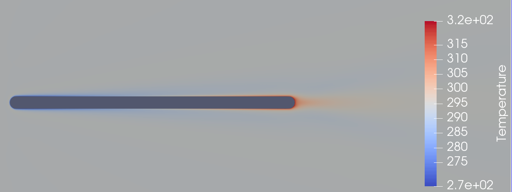
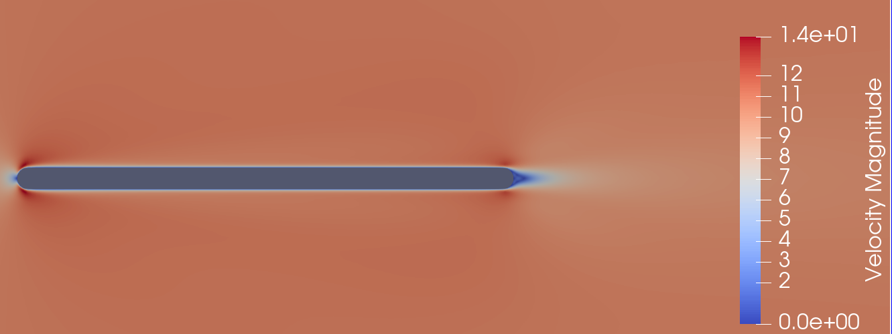

## Problem definition 

## Results:

## Simulation Results

### Flow Residuals

### Temperature Distribution

### Velocity Distribution

''' 
# Main iteration loop
  while (iIter < max_iterations):
    # 1. Preprocess the current iteration
    SU2Driver.Preprocess(iIter)

    # 2. Get the ENTIRE coordinate matrix ONCE per iteration
    all_coords = SU2Driver.MarkerCoordinates(CHTMarkerID)

    # 3. Loop through every vertex to set temperature
    for iVertex in range(nVertex_CHTMarker):
        
        # Access the x-coordinate from the 'all_coords' matrix we just got
        # Row = iVertex, Column = 0 (x-coordinate)
        x_pos = all_coords.Get(iVertex, 0)
        
        # Spatial function: Linear ramp (293.15K to 350K over 0.035m)
        L_plate = 0.035
        T_inlet = 293.15
        T_outlet = 350.0
        WallTemp_Spatial = T_inlet + (T_outlet - T_inlet) * (x_pos / L_plate)
        
        # Apply local temperature
        SU2Driver.SetMarkerCustomTemperature(CHTMarkerID, iVertex, WallTemp_Spatial)

    # 4. Update boundary conditions and run solver
    SU2Driver.BoundaryConditionsUpdate()
    SU2Driver.Run()
    SU2Driver.Postprocess()
    SU2Driver.Update()

    # 5. Monitor convergence and handle output
    stopCalc = SU2Driver.Monitor(iIter)
    
    if (iIter % 50 == 0):
        SU2Driver.Output(iIter)
        if rank == 0:
            print(f"--- Iteration {iIter}: Solution snapshot saved ---")

    if (stopCalc == True):
        if rank == 0: print("Convergence reached!")
        break
    
    iIter += 1
    '''
